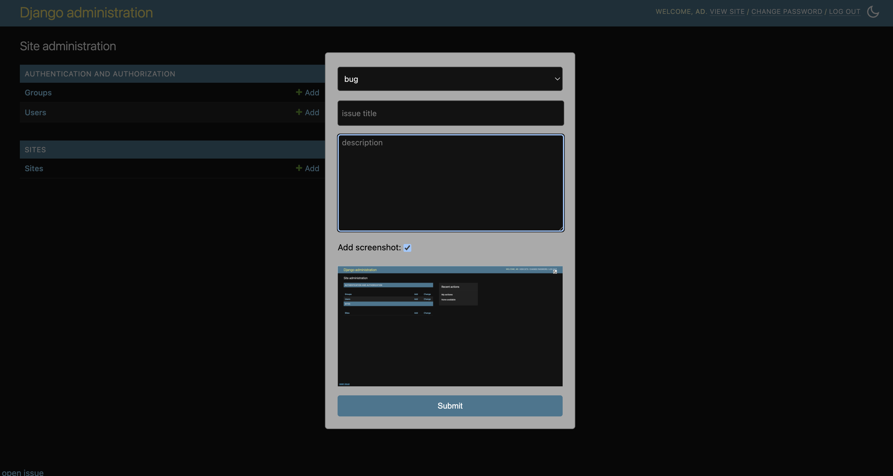
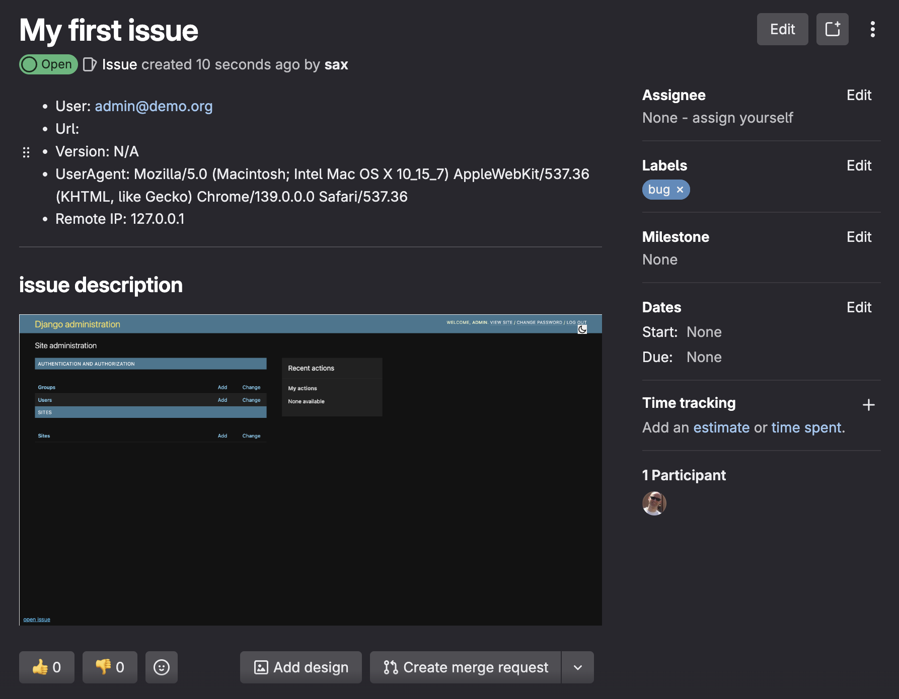
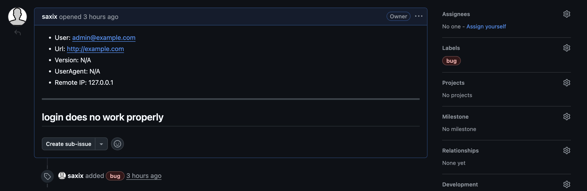

# Django Issues

**Django Issues** is a reusable Django app for collecting and reporting user-submitted issues (tickets).
It provides a view and a form to submit tickets and forwards them to configurable backends
like GitLab, GitHub, email, or simply the development console.

## Features

-   **Easy Integration**: Seamlessly add a ticketing system to your Django project.
-   **Multiple Backends**: Send tickets to various platforms. Built-in backends include:
    -   Console (default)
    -   Email
    -   GitLab
    -   GitHub
    -   (Others can be easily added)
-   **Configurable**: Customize the backend and its options through Django's settings.
-   **Extensible**: Create your own custom backends to integrate with any issue-tracking system.
-   **Screenshot Capture**: Users can attach a screenshot of the current page to the ticket.

### Planned (contributions are welcome)

- Jira
- Azure Devops
- Redmine
- Odoo Helpdesk
- ...

## Screenshot

#### In App popup (with ap screenshot)

#### GitLab Ticket

#### Github Ticket

