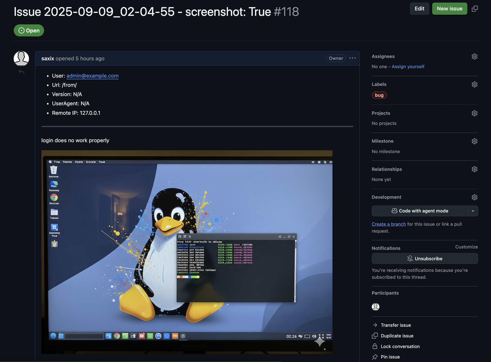

# Welcome to Django-Online-Issues

**Django Online Issues** is a reusable Django app for collecting and reporting user-submitted issues (tickets).
It provides a view and a form to submit tickets and forwards them to configurable backends
like GitLab, GitHub, email, or simply the development console.

This documentation will guide you through the installation, configuration, and usage of the app.

## Key Features

-   **Easy Integration**: Seamlessly add a ticketing system to your Django project.
-   **Multiple Backends**: Send tickets to various platforms. Built-in backends include:
    -   Console (default)
    -   Email
    -   GitLab
    -   GitHub
-   **Configurable**: Customize the backend and its options through Django's settings.
-   **Extensible**: Create your own custom backends to integrate with any issue-tracking system.
-   **Screenshot Capture**: Users can attach a screenshot of the current page to the ticket, using one of several supported rendering engines (`html2canvas`, `dom-to-image`).
-   **Enhanced User Feedback**: The issue submission form provides clear, inline feedback for both successful submissions and validation errors, creating a smooth user experience without disruptive alerts.

## Screenshots

### In-App Popup

### GitLab Ticket

### GitHub Ticket

### GitHubRepo Ticket

## Getting Started

To get started with `django-online-issues`, follow these steps:

1.  **Installation**: Read the [Installation guide](installation.md) to install the package.
2.  **Configuration**: Follow the [Configuration guide](configuration.md) to set up the app in your Django project and configure a backend.
3.  **Usage**: Learn how to add the issue reporting button to your templates in the [Usage guide](usage.md).

## Advanced Topics

-   **Custom Backends**: Learn how to create your own backend to integrate with any service in the [Custom Backends guide](custom_backends.md).
-   **Testing**: Find out how to run the test suite and what options are available in the [Testing guide](testing.md).

For more information, you can also visit the [GitHub repository](https://github.com/saxix/django-online-issues).
